# 🛠️ Alet ve Edevat - React Native Uygulaması

Bu proje, mevcut React (TypeScript) tabanlı web uygulamasının, **JavaScript** kullanılarak **React Native (Expo)** ekosistemine geçirilmesi (migration) amacıyla geliştirilmektedir. 

Uygulama, mobil cihazlar için optimize edilmiş bir kullanıcı deneyimi sunmak üzere yeniden yapılandırılmıştır.

## 📋 İçindekiler
- [Özellikler](#-özellikler)
- [Teknoloji Yığını](#-teknoloji-yığını)
- [Mimari Değişiklikler ve Geçiş Detayları](#-mimari-değişiklikler-ve-geçiş-detayları)
- [Proje Yapısı](#-proje-yapısı)
- [Kurulum ve Çalıştırma](#-kurulum-ve-çalıştırma)
- [Doğrulama ve Test Planı](#-doğrulama-ve-test-planı)
- [⚠️ Bekleyen Kararlar (Kullanıcı Onayı)](#-bekleyen-kararlar-kullanıcı-onayı)

---

## ✨ Özellikler
- 🔐 **Kimlik Doğrulama:** Firebase tabanlı Giriş ve Kayıt akışları.
- 🗺️ **Yerel Harita Deneyimi:** Web tabanlı SVG harita yerine, yüksek performanslı `react-native-maps` entegrasyonu.
- 🌓 **Tema Desteği:** Cihazın sistem ayarlarına (`Appearance` API) duyarlı Açık/Koyu tema desteği.
- 📱 **Mobil Navigasyon:** Web yönlendirmesi yerine, `react-navigation` ile Stack ve Bottom Tab navigasyonu.
- 💾 **Yerel Depolama:** Web `localStorage` mantığının mobil `AsyncStorage` ile değiştirilmesi.

---

## 🛠️ Teknoloji Yığını
- **Çatı:** React Native (JavaScript / JSX)
- **Geliştirme Aracı:** Expo
- **Navigasyon:** React Navigation (Stack & Bottom Tabs)
- **Veritabanı & Auth:** Firebase
- **Harita:** `react-native-maps`
- **İkonlar:** `lucide-react-native`
- **Yerel Depolama:** `@react-native-async-storage/async-storage`

---

## 🔄 Mimari Değişiklikler ve Geçiş Detayları

Web uygulamasından mobil uygulamaya geçişte aşağıdaki temel dönüşümler uygulanmıştır:

1. **Dil Dönüşümü:** Tüm TypeScript (`.ts` / `.tsx`) dosyaları, tip tanımları kaldırılarak veya basitleştirilerek JavaScript (`.js` / `.jsx`) formatına dönüştürülmüştür.
2. **DOM -> Native Bileşenler:** 
   - `div` ➔ `View`
   - `button` ➔ `TouchableOpacity` / `Pressable`
   - `img` ➔ `Image`
   - `span`/`p` ➔ `Text`
3. **Depolama:** `localStorage` kullanımı, `@react-native-async-storage/async-storage` ile değiştirilmiştir (`dbService.js`).
4. **Harita:** SVG tabanlı harita bileşeni tamamen kaldırılarak, native performans sunan `react-native-maps` ile değiştirilmiştir.
5. **UI Bileşenleri:** 
   - `Navbar` ➔ Bottom Tab Navigator veya Native Header yapısına dönüştürülmüştür.
   - `ToolDetailCard`, `AddToolModal`, `QrModal` ➔ React Native `Modal` veya `Bottom Sheet` (Alt sayfa) mimarisine uyarlanmıştır.

---

## 📂 Proje Yapısı

```text
alet-ve-edevat-rn/
├── app.json                 # Expo yapılandırma dosyası
├── package.json             # Bağımlılıklar ve scriptler
├── package-lock.json        # Bağımlılık kilidi
├── .env                     # Ortam değişkenleri (FIREBASE_*)
├── .gitignore               # Git ignore kuralları
├── README.md                # Bu dosya
├── src/
│   ├── components/          # Yeniden yazılmış mobil bileşenler (View, Text vb.)
│   │   ├── ToolDetailCard.js
│   │   ├── AddToolModal.js
│   │   ├── QrModal.js
│   │   └── ...
│   ├── contexts/            
│   │   ├── AuthContext.js   # Firebase Auth yönetimi
│   │   └── ThemeContext.js  # Appearance API entegreli tema yönetimi
│   ├── lib/
│   │   ├── firebase.js      # Firebase başlatma ve ayarları
│   │   └── dbService.js     # AsyncStorage tabanlı veri işlemleri
│   ├── navigation/
│   │   └── AppNavigator.js  # Stack ve Tab navigasyon kurulumu
│   └── screens/
│       ├── AuthScreen.js    # Giriş ve Kayıt ekranları (eski AuthPage)
│       ├── HomeScreen.js    # Ana harita ve içerik ekranı (eski App.tsx)
│       └── RequestsScreen.js# RequestCenter bileşeninin tam ekran versiyonu
└── assets/                  # Görseller, fontlar vb.
    └── images/
```

## 🚀 Kurulum ve Çalıştırma
### 1. Bağımlılıkları Yükleyin
```properties
1. npm install 
3. # yada
2. yarn install
```

### 2. Ortam Değişkenlerini Ayarlayın
Proje kök dizininde `.env` dosyası oluşturun ve Firebase yapılandırma bilgilerinizi ekleyin:

```properties
EXPO_PUBLIC_FIREBASE_API_KEY="..."
EXPO_PUBLIC_FIREBASE_AUTH_DOMAIN="..."
EXPO_PUBLIC_FIREBASE_PROJECT_ID="..."
EXPO_PUBLIC_FIREBASE_STORAGE_BUCKET="..."
EXPO_PUBLIC_FIREBASE_MESSAGING_SENDER_ID="..."
EXPO_PUBLIC_FIREBASE_APP_ID="..."
EXPO_PUBLIC_FIREBASE_MEASUREMENT_ID="..."
```

### 3. Uygulamayı Başlatın
Expo geliştirme sunucusunu başlatmak için:
```bash
npm start
# yada
npx expo start
```
- **Mobil Cihaz:** Ekranındaki QR kodu telefonunuzdaki **Expo Go** uygulamasıyla tarayın.
- **Emülatör:** Terminalde `a` (Android) veya `i` (iOS) tuşlarına basın.
- **Web:** Tarayıcıda test etmek için `w` tuşuna basın.

## ✅ Doğrulama ve Test Planı
Projenin sağlıklı çalıştığından emin olmak için aşağıdaki adımlar düzenli olarak kontrol edilmelidir:

### Otomatik Doğrulama

- Proje hatasız bir şekilde derlenmelidir:
```bash
npx expo export
```

### Manuel Doğrulama (Checklist)
- Uygulama Expo CLI üzerinden başarıyla başlatılıyor ve QR kod / emülatör ile açılıyor.
- **Tema Geçişi:** Cihazın koyu/açık modu değiştirildiğinde uygulama teması anında güncelleniyor.
- **Auth Akışı:** Kullanıcı başarıyla kayıt olabiliyor, giriş yapabiliyor ve oturumu kalıcı olarak saklanıyor (AsyncStorage kontrolü).
- **Harita:** `HomeScreen` üzerinde `react-native-maps` sorunsuz yükleniyor, zoom ve pin etkileşimleri çalışıyor.
- **Navigasyon:** Tab bar ve stack geçişleri akıcı çalışıyor, geri tuşu beklendiği gibi davranıyor.
- **Formlar:** Tüm giriş alanları (input) mobil klavye ile uyumlu çalışıyor.
- **Modal'lar:** Alt sayfa (bottom sheet) ve modal pencereleri düzgün açılıp kapanıyor.

## 📱 Arayüz ve Ekran Görüntüleri

### Ana Ekran

<div style="display: flex; gap=10px;">
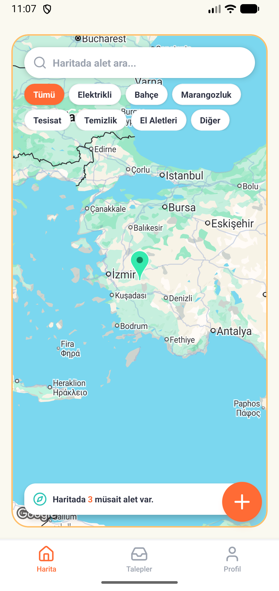&nbsp;
 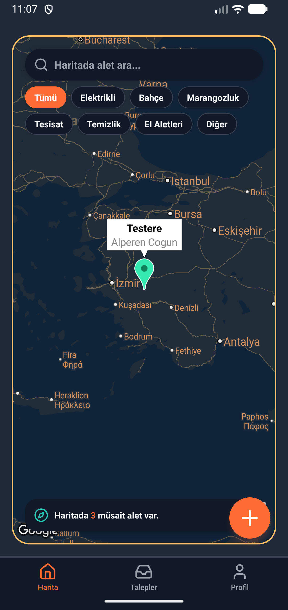&nbsp;
 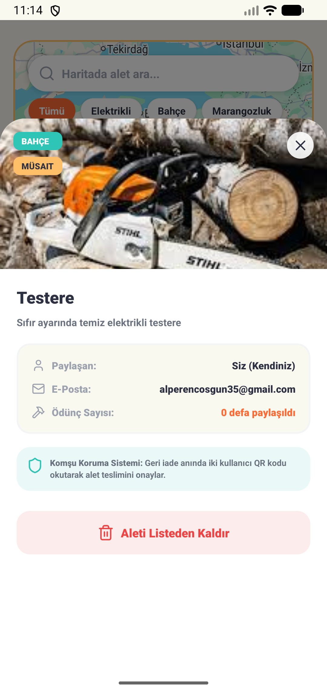&nbsp;
 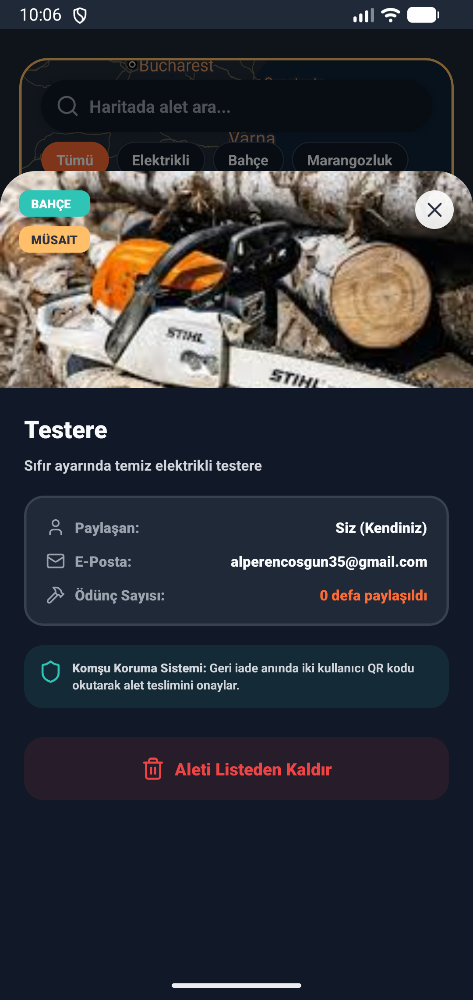&nbsp;
</div>

### Giriş/Kayıt Ekranı

<div style="display: flex; gap=10px;">
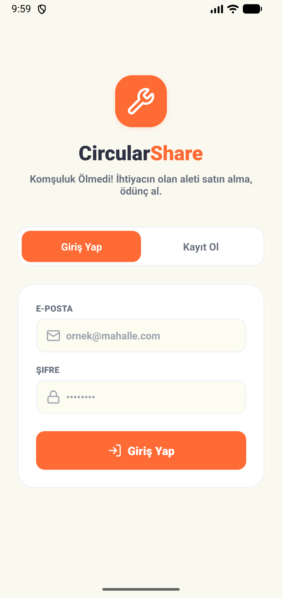&nbsp;
 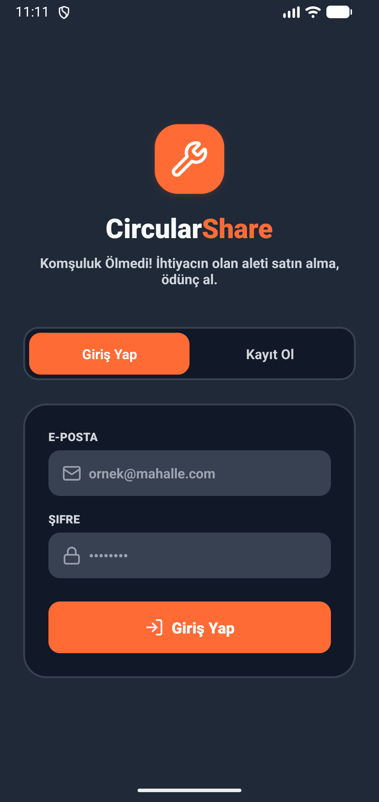&nbsp;
 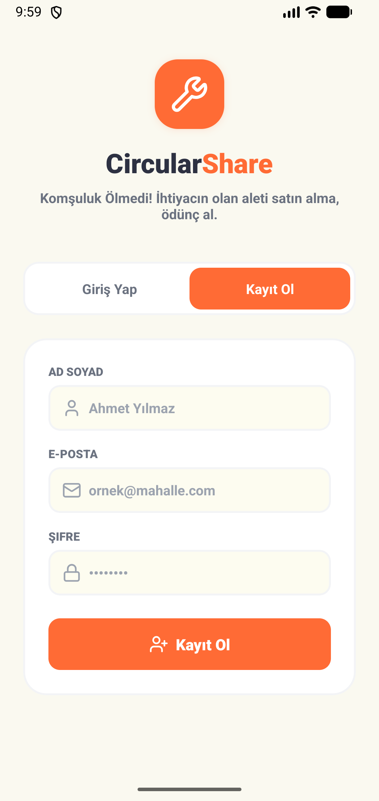&nbsp;
 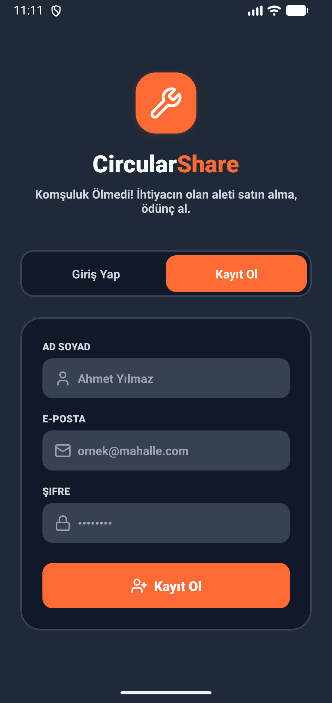&nbsp;
</div>

### Talep Ekranı

<div style="display: flex; gap=10px;">
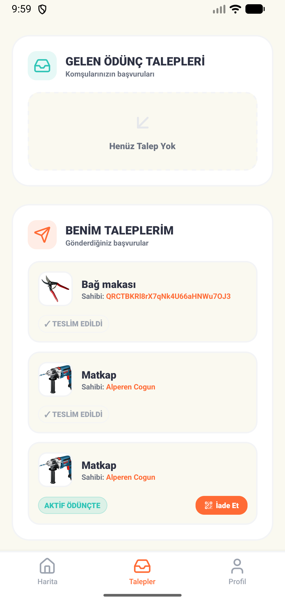&nbsp;
 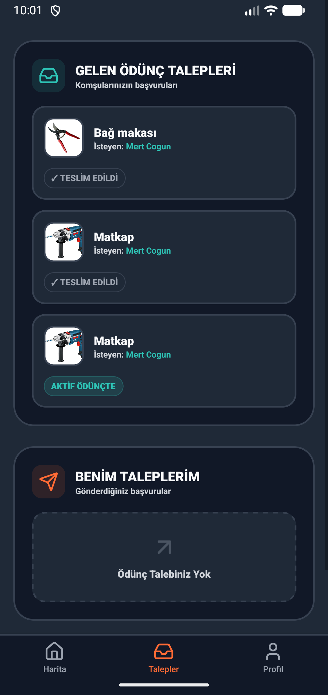
</div>

### Talep Ekranı

<div style="display: flex; gap=10px;">
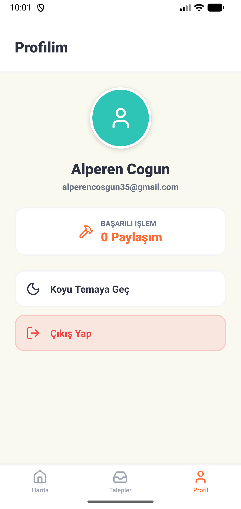&nbsp;
 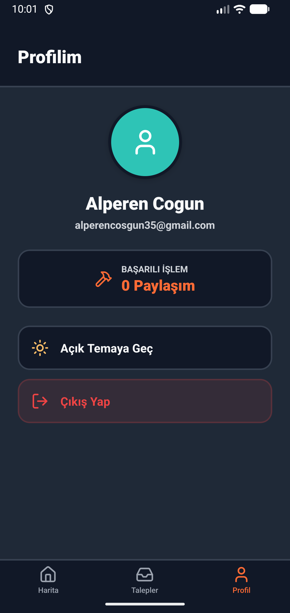
</div>

## 📞 İletişim
Proje ile ilgili sorularınız için:
- **Email:** alperencosgun35@gmail.com
- **GitHub Issues:** Issues"# alet-ve-edevat" 
